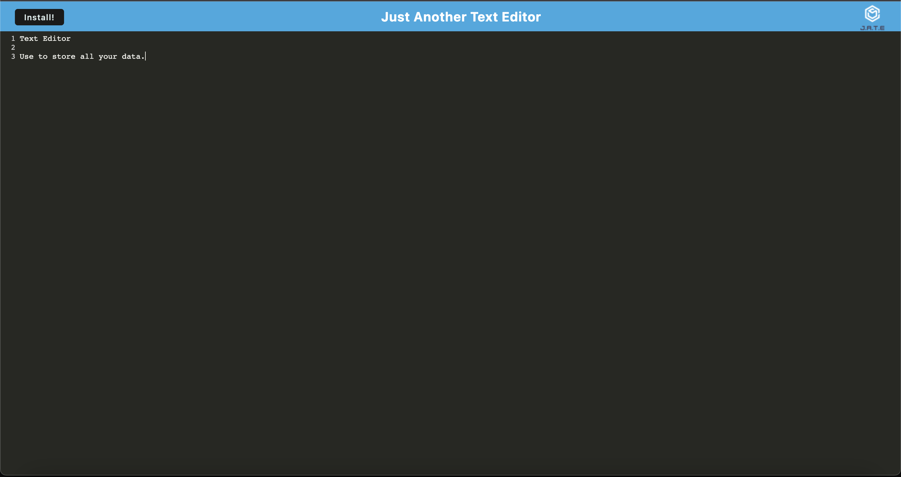

# Edit-Your-Text

## Table of Contents
* General Info
* Installation
* Screenshot
* Heroku Deployed Link
* Collaborations

## General Information
This app is a text editor that runs in the browser using the PWA critera. It features a number of data persistence techniques that serve as reduncy in case one of the options is not supported by the browser. This application will function offline if there is no internet connection. The idb package was used to store and retrieve data. 

## Installation
* npm i
* npm start

## Screenshot

## Heroku Deployed Link
https://pwa-edityourtext.herokuapp.com/

## Collaborations
If you would like to contribute or ask any questions please feel free to contact me.\
Email: ehamzapour@gmail.com